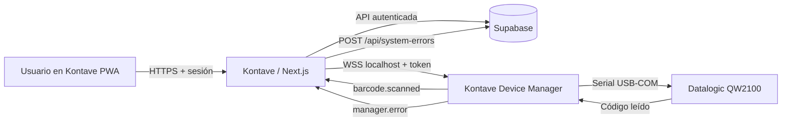

# Kontave y Kontave Device Manager: contexto técnico y estratégico

**Fecha de corte:** 11 de agosto de 2026  
**Estado:** Documento de referencia para dirección, producto, soporte e ingeniería.

## 1. Resumen ejecutivo

Kontave es una aplicación SaaS/PWA desplegada en Vercel y respaldada por Supabase. Sus módulos de inventario, compras y ventas ya soportan códigos de barras. Kontave Device Manager es una aplicación Windows separada que conecta dispositivos físicos locales con la PWA mediante un gateway WebSocket seguro en `wss://localhost:47831`.

La integración con el lector Datalogic QuickScan QW2100 fue validada de extremo a extremo: Windows expuso el lector mediante USB-COM, Device Manager lo abrió como puerto serial, la PWA se emparejó y compras/ventas recibieron lecturas. Para productos nuevos creados desde una compra, el código escaneado inicializa tanto el código interno como el código de barras, sin sobrescribir después un código interno editado manualmente.

La decisión recomendada es mantener dos canales de distribución:

- **Microsoft Store/MSIX como canal principal:** instalación confiable, firma gratuita del paquete y actualizaciones administradas por Microsoft.
- **NSIS/GitHub como canal secundario:** soporte, pruebas y despliegues empresariales; requerirá firma Authenticode para una distribución pública profesional.

El driver USB-COM de Datalogic no debe incorporarse actualmente a ningún instalador de Kontave. La licencia pública prohíbe redistribuir el software sin consentimiento previo por escrito y MSIX no admite instalación de drivers.

## 2. Estado actual verificable

| Componente | Estado |
|---|---|
| Kontave web/PWA | Integración de códigos de barras y Device Manager comprometida en `1488367` (`master`). |
| Base de datos | Migración `195_shared_inventory_product_barcode.sql` aplicada; `barcode` se maneja por tenant y producto. |
| Compras | Busca productos por código de barras, agrega productos existentes y permite alta rápida de productos escaneados. |
| Ventas | Busca y agrega productos registrados mediante el mismo código de barras. |
| Device Manager publicado | Último GitHub Release: `v0.1.2`. |
| Device Manager en `main` | Commit `09f530a`; versión `0.1.3` con ciclo de arranque Electron corregido. |
| Device Manager local | Versión `0.1.4` compilada e instalada, todavía sin commit/release. |
| QW2100 | Flujo validado con `VID_05F9`, driver USB-COM y puerto `COM16`. |
| Errores centralizados | Eventos de Device Manager verificados en `system_error_logs` mediante `/api/system-errors`. |
| Firma pública | Pendiente. El instalador NSIS continúa sin una firma Authenticode pública. |

### Cambios locales pendientes de versionar

En `kont` permanecen cambios del contrato y cliente de errores de Device Manager. En `kontave-devices-manager` permanecen la versión `0.1.4`, branding, cola y deduplicación de errores, reporte estructurado y filtrado exclusivo del VID Datalogic. Estos cambios deben revisarse y agruparse en commits separados antes del siguiente release.

## 3. Arquitectura y relación entre los productos

### Kontave

- Next.js 16 App Router, React 19, PWA, Vercel y Supabase.
- La sesión, el tenant y los permisos permanecen en la aplicación web.
- `DeviceManagerProvider` mantiene disponibilidad, emparejamiento, estado del dispositivo, reconexión y suscripciones por contexto (`purchase`, `sale`, `product-capture`).
- La CSP autoriza exclusivamente `wss://localhost:47831` para el agente local.
- `/api/system-errors` valida la sesión/tenant y persiste incidentes sanitizados en `system_error_logs`.

### Kontave Device Manager

- Electron + Node.js, `serialport`, `ws` y `electron-updater`.
- Escucha sólo en `127.0.0.1`; no expone el gateway a la red local ni a Internet.
- Genera un certificado TLS para `localhost` y utiliza WSS.
- Autoriza orígenes conocidos y exige aprobación explícita para el primer emparejamiento.
- Almacena únicamente el hash del token; la PWA conserva el token original.
- El adaptador QW2100 acepta automáticamente sólo dispositivos con VID Datalogic `05F9`, evitando confundir módems, teléfonos u otros puertos seriales.
- Mantiene logs locales rotables y reporta errores a la PWA autenticada. Repite un mismo error como máximo cada cinco minutos y conserva hasta 50 errores en memoria cuando la PWA está cerrada.

### Flujo de una lectura

1. El QW2100 funciona en modo USB-COM y Windows crea un puerto serial mediante el driver Datalogic.
2. Device Manager detecta el VID `05F9`, abre el puerto a 9600 baudios y procesa la lectura terminada en CR.
3. El gateway genera `barcode.scanned` con identificador único, dispositivo, valor y fecha.
4. La PWA acepta el evento sólo cuando está visible, enfocada y emparejada.
5. Compras, ventas o captura de producto reciben el evento según el contexto activo.

## 4. Seguridad y observabilidad

### Controles existentes

- TLS local con SAN `localhost`, certificado almacenado por usuario y vigencia de tres años.
- WSS limitado a loopback y allowlist de orígenes.
- Emparejamiento con aprobación humana y token persistido como hash en el agente.
- CSP explícita para impedir conexiones a agentes arbitrarios.
- Payload WebSocket máximo de 4 KB y protocolo versionado.
- Deduplicación de lecturas y de reportes de error.
- Metadatos de error limitados a código, versión, instalación seudónima y fecha; no se envían contraseñas, cookies ni tokens.

### Limitaciones y mejoras pendientes

- El certificado TLS se genera durante el primer arranque; el instalador futuro debe mejorar la explicación y diagnóstico de esa operación.
- La cola de errores pendientes está en memoria y se pierde si Device Manager se cierra antes de reconectar con la PWA.
- El gateway necesita un endpoint HTTPS de salud para diagnóstico humano y automatizado; hoy una navegación HTTP queda esperando porque sólo se atienden upgrades WebSocket.
- Debe existir una vista administrativa/soporte para filtrar incidentes por versión, instalación y tenant.
- El identificador de instalación es seudónimo, pero debe incluirse expresamente en la política de privacidad y retención.

## 5. Distribución, firma y actualizaciones

### Estrategia recomendada: canal dual

| Criterio | Microsoft Store / MSIX | NSIS / GitHub |
|---|---|---|
| Firma | Microsoft firma gratis después de certificación. | Requiere Authenticode propio para producción. |
| SmartScreen | Sin advertencia para instalación desde Store. | Puede bloquear o advertir hasta disponer de firma/reputación. |
| Actualizaciones | Administradas por Microsoft Store. | `electron-updater` y GitHub Releases. |
| Driver Datalogic | No puede instalar drivers. | Técnicamente puede ejecutar MSI, sujeto a licencia y firma. |
| Soporte empresarial | Store privada/Intune según organización. | Flexible para soporte directo, GPO/MDM y entornos controlados. |
| Control de publicación | Certificación y tiempos de Store. | Control completo del equipo de Kontave. |

La compilación Store debe usar el target AppX/MSIX de Electron Builder, identidad reservada en Partner Center y assets específicos. En ese build se debe desactivar `electron-updater`, porque las actualizaciones AppX son responsabilidad de Microsoft Store.

El canal NSIS debe conservarse para pruebas y contingencia. Antes de promoverlo como descarga pública se debe obtener un certificado OV o usar Azure Artifact Signing si la entidad solicitante cumple los requisitos regionales.

Referencias oficiales:

- [Microsoft: opciones de firma para aplicaciones Windows](https://learn.microsoft.com/es-es/windows/apps/package-and-deploy/code-signing-options)
- [Microsoft: distribución de aplicaciones Win32 mediante Store](https://learn.microsoft.com/en-us/windows/apps/distribute-through-store/how-to-distribute-your-win32-app-through-microsoft-store)
- [Electron Builder: AppX y Microsoft Store](https://www.electron.build/docs/appx/)
- [Microsoft: MSIX no soporta instalación de drivers](https://learn.microsoft.com/en-us/windows/msix/packaging-tool/know-your-installer)

## 6. Driver Datalogic: decisión legal y operativa

### Decisión vigente

No copiar, alojar ni incluir `Datalogic_USBComDriver_7.1.5_Windows_x64.msi` dentro de Kontave, GitHub Releases, NSIS o MSIX hasta obtener autorización expresa de Datalogic.

La EULA pública concede una licencia personal, no transferible y no sublicenciable, y prohíbe distribuir el software sin consentimiento previo por escrito. Que el driver sea gratuito y públicamente descargable no concede por sí solo derecho de redistribución.

Referencia: [Datalogic End User License Agreement](https://www.datalogic.com/upload/pages/Product/Datalogic_End_User_License_Agreement.pdf).

### Experiencia recomendada mientras no exista permiso

- Detectar el QW2100 en modo HID y explicar que debe cambiarse a USB-COM.
- Ofrecer un enlace oficial al driver y a la hoja de configuración USB-COM.
- Verificar automáticamente cuándo aparece el VID `05F9` y mostrar el puerto resultante.
- Mantener instrucciones ilustradas y un diagnóstico que distinga: driver ausente, modo HID, puerto ocupado y lector desconectado.
- No automatizar ni eludir formularios, EULA o controles de descarga del fabricante en producción.

### Qué debe autorizar Datalogic

La autorización debe permitir expresamente a Kontave:

- Redistribuir el MSI x64 sin modificar dentro del instalador NSIS.
- Entregarlo a clientes comerciales en los países donde opera Kontave.
- Publicar versiones futuras o definir cómo se autoriza cada actualización.
- Mostrar o aceptar la EULA correspondiente durante la instalación.
- Usar el nombre Datalogic y QW2100 únicamente para compatibilidad técnica.
- Verificar y publicar hashes sin alterar la firma original.

### Plantilla de solicitud

> Asunto: Solicitud de autorización para redistribuir Datalogic USB-COM Driver con Kontave Device Manager
>
> Kontave desarrolla una aplicación Windows que permite conectar lectores Datalogic adquiridos por nuestros clientes con nuestra plataforma de inventario y facturación. Solicitamos autorización escrita para redistribuir, sin modificaciones, el instalador `Datalogic USB-COM Driver 7.1.5 Windows x64` dentro del instalador NSIS de Kontave Device Manager.
>
> El driver se utilizará exclusivamente para comunicación con equipos Datalogic compatibles. Mantendremos intactas las firmas, avisos, EULA y marcas del fabricante. Agradecemos confirmar territorios autorizados, versiones cubiertas, requisitos de atribución, mecanismo de actualización y cualquier condición comercial o técnica aplicable.

## 7. Roadmap recomendado

### Fase 1: estabilizar `0.1.4`

- Reconectar el QW2100 y repetir lectura en compra, venta y alta rápida.
- Confirmar que ningún puerto no Datalogic sea seleccionado.
- Validar branding en ejecutable, NSIS, bandeja y ventana.
- Confirmar un incidente real con detalle técnico en `system_error_logs`.
- Crear commits separados en ambos repositorios y publicar `v0.1.4` sólo después de la prueba local completa.

### Fase 2: onboarding profesional

- Añadir diagnóstico HTTP `/health` en localhost.
- Detectar HID Datalogic antes de tener COM y guiar el cambio de interfaz.
- Mostrar estado del driver, puerto, permisos, certificado y conexión PWA.
- Incorporar reintentos, reparación de certificado y exportación de paquete de soporte.

### Fase 3: Microsoft Store

- Registrar la cuenta de desarrollador y reservar el nombre en Partner Center.
- Crear configuración AppX/MSIX, manifest, identidad y assets Store.
- Sustituir autoarranque de registro por `startupTask` compatible con el paquete.
- Desactivar `electron-updater` para builds Store.
- Probar acceso serial, escritura de configuración, TLS localhost y actualización sobre una instalación MSIX limpia.
- Ejecutar Windows App Certification Kit y enviar primero un flight privado.

### Fase 4: expansión de dispositivos

- Mantener contratos genéricos por categoría y adaptadores independientes.
- Añadir impresora fiscal, balanza, impresora de recibos o terminal de pago sólo con aislamiento por adapter y permisos explícitos.
- Versionar capacidades del protocolo para que una PWA nueva sea compatible con agentes anteriores durante una ventana definida.

## 8. Criterios de salida a producción

- Instalación limpia en Windows 10 y 11 sin pasos de desarrollo.
- QW2100 detectado únicamente como Datalogic USB-COM y lectura correcta en compras/ventas.
- Emparejamiento, olvido y reemparejamiento probados.
- Reinicio de Windows y autoarranque verificados.
- Actualización desde la versión anterior sin perder certificado, configuración ni token.
- Errores visibles localmente y persistidos en el API con deduplicación.
- Canal Store certificado o NSIS firmado; nunca distribuir públicamente un NSIS sin firma como solución final.
- Driver distribuido por Kontave únicamente si existe autorización escrita archivada.

## 9. Decisiones registradas

1. Device Manager permanece en repositorio separado porque tiene ciclo de release, dependencias nativas y superficie de seguridad independientes.
2. El protocolo se mantiene genérico para admitir más dispositivos; QW2100 es el primer adapter, no el nombre del producto.
3. El navegador nunca accede directamente al puerto serial; Device Manager concentra drivers, permisos y aislamiento local.
4. Microsoft Store/MSIX será el canal principal recomendado y NSIS/GitHub el canal secundario.
5. El driver Datalogic seguirá siendo una dependencia externa hasta que el fabricante autorice formalmente su redistribución.
6. Los errores se registran en el API a través de la PWA autenticada para no almacenar credenciales cloud en el ejecutable local.

